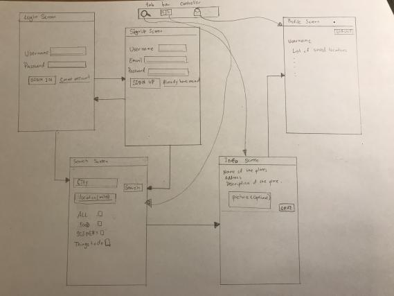

# Destination Vacation

## Table of Contents
1. [Overview](#Overview)
2. [Product Spec](#Product-Spec)
3. [Wireframes](#Wireframes)
4. [Schema](#Schema)

## Overview
### Destination Vacation is an app that allows a user to search for points of interest and things to do nearby the current location. A user can also search for a specific city and use filters for types of activities. Users can log in to bookmark places for future reference.

### App Evaluation
[Evaluation of your app across the following attributes]
- **Category: Tourism Information**
- **Mobile: Website is interactive, location services, mobile first experience **
- **Story: Allows users to search for and save nearby points of interests.*
- **Market: Anyone that needs to look for things to do near them. Ability to save locations allows users to search places to quickly reference later.**
- **Habit: Users can look up for points of interest before they make a decision on activities they would like to do and places before visiting. **
- **Scope: The destination vacation app allows for searching of points of interests near the user. Can also save locations and search for locations within other cities. **

## Product Spec

### 1. User Stories (Required and Optional)

**Required Must-have Stories**

* User can create an account using a username and a password
* User can login to their account using their username and password
* TODO User can do something with their account
   *  Pin attractions and save their favorite attractions
*  User can enter a location by name and define a radius of places nearby, and app takes user query to find attractions within that radius
*  User can filter results with the following categories: “Food”, “Things to do”, and “Scenery”

**Optional Nice-to-have Stories**
* User can view a map showing locations of attractions
* Social interaction
   * Users can post pictures or reviews of locations
   * Users can look at other users’ saved locations

### 2. Screen Archetypes

* Login Screen
   * User can login using their username and password
* Sign Up screen 
   * User can create an account using a username and a password
* Search Screen
   * User can search for places nearby 
   * User can use search bar to look for destinations 
   * User can pick between “Food”, “Things to do”, and “Scenery” 
* Info Screen
   * User can view search results with selected filters
   * User can view more information on selected locations

### 3. Navigation

**Tab Navigation** (Tab to Screen)

* Search Screen
* Information Page 
* Profile 

**Flow Navigation** (Screen to Screen)

* Login Screen
   * Search Screen
* Sign Up Screen
   * Search Screen 
* Search Screen 
   * Info Screen 

## Wireframes

### [BONUS] Digital Wireframes & Mockups

### [BONUS] Interactive Prototype

## Schema
### Models
#### Place

   | Property     | Type     | Description                             |
   | ------------ | -------- | --------------------------------------- |
   | objectId     | String   | unique id for the place (default field) |
   | name         | String   | name of place                           |
   | description  | String   | description of place                    |
   | address      | String   | address of place                        |
   | bookmarked   | Boolean  | is location bookmarked by the user      |
   | image        | String   | link to pictures                        |

### Networking
#### List of network requests by screen
   - Info Screen
      - (Read/GET) Query all nearby locations
      - (Create/POST) Bookmark/favorite a location
      - (Delete) Unbookmark/unfavorite a location
   - Profile Screen
      - (Read/GET) Query logged in user object
      - (Read/GET) Query all bookmarked locations

#### Existing API Endpoints
##### OpenTripMap API
- Base URL - [https://www.opentripmap.io/product](https://www.opentripmap.io/product)

   HTTP Verb | Endpoint                   | Description
   --------- | -------------------------- | ------------
    `GET`    | /{lang}/places/geoname     |  returns the place whose name is most similar to searchstring
    `GET`    | /{lang}/places/bbox        |  returns all objects in the given boundary box (can be filtered)
    `GET`    | /{lang}/places/radius      | returns the closest objects to the selected point
    `GET`    | /{lang}/places/autosuggest | returns suggestions for search term closest to the selected point
    `GET`    | /{lang}/places/xid/{xid}   | return detailed information about the object
